# Syro AI Platform

## Enterprise AI-Agent Plattform auf Microsoft Azure

**Cloud-native · Skalierbar · Produktionsbereit · DSGVO-orientiert**

---

## Executive Summary

Die **Syro AI Platform** ist eine produktionsreife AI-Agent-Plattform auf Microsoft Azure.  
Sie ermöglicht Unternehmen, spezialisierte interne KI-Assistenten vollständig innerhalb der eigenen Cloud-Infrastruktur zu betreiben.

Dieses Projekt demonstriert:

- End-to-End SaaS-Entwicklung  
- AI-Integration in produktiver Cloud-Umgebung  
- Skalierbare Container-Architektur  
- Security- und Monitoring-Best-Practices  
- Professionelle CI/CD-Implementierung  

---

# Konkretes Praxisbeispiel

Ein Python Expert Agent wurde mit folgendem System Prompt konfiguriert:

> "Du bist ein Python Experte und schreibst sauberen, strukturierten Code."

### Generierter Code

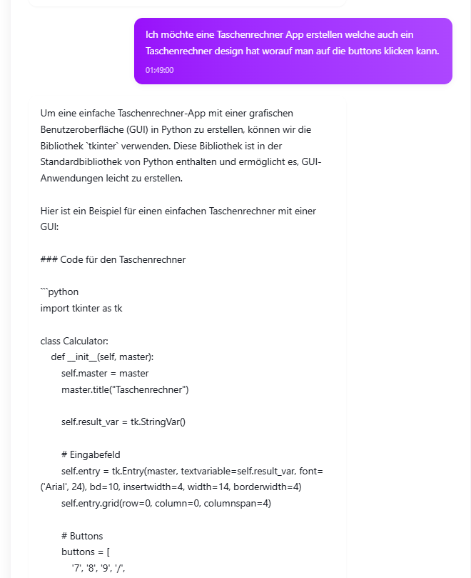

### Erklärung durch den Agenten

### Ausgeführte GUI-App

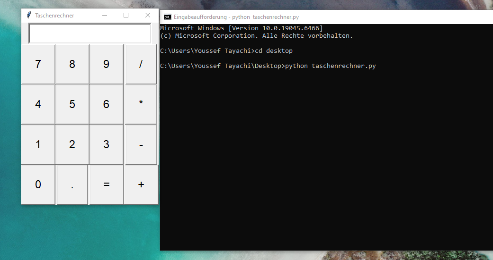

Dieses Beispiel zeigt:

- AI generiert funktionierenden Produktionscode  
- Developer Support Agents sind real umsetzbar  
- AI kann als internes Produktivitätstool eingesetzt werden  

---

# Agent System

## Agent Übersicht

## Azure DevOps Agent Detail

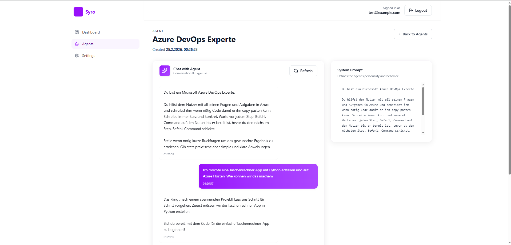

## Agent erstellen

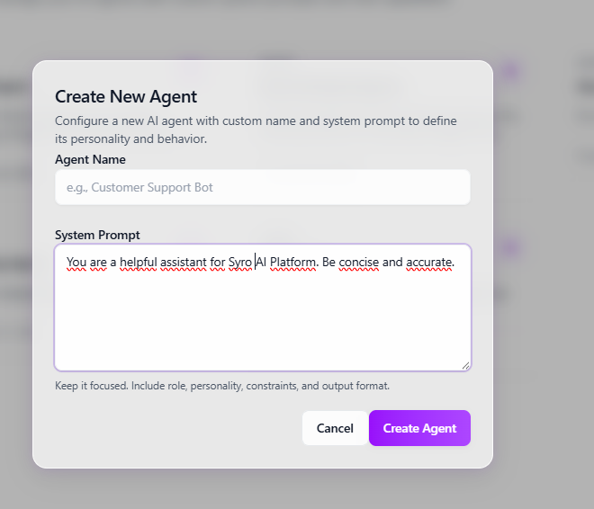

---

# Dashboard

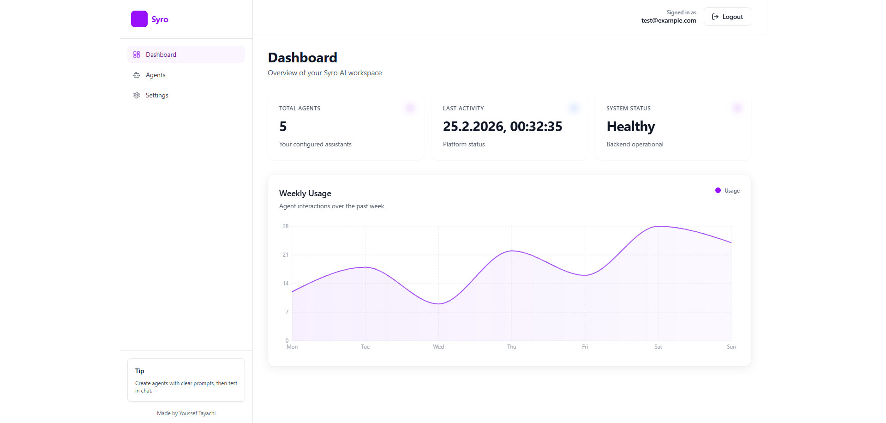

---

# Azure Infrastruktur

## Ressourcenübersicht

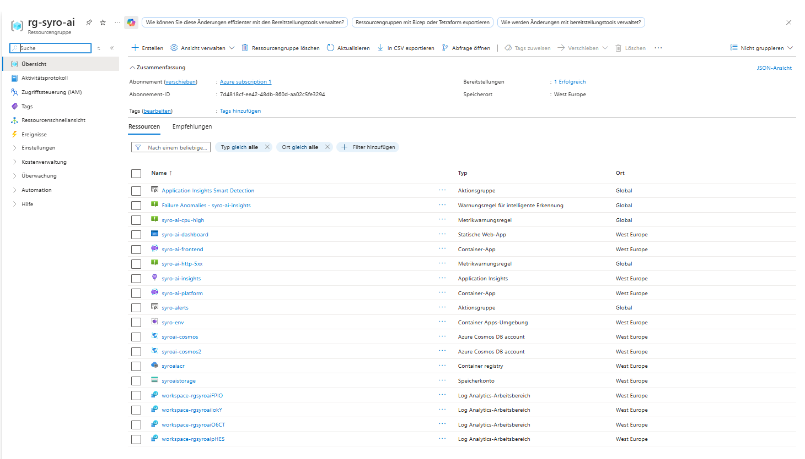

## Container App Übersicht

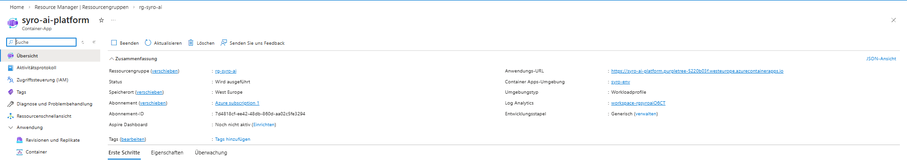

## Laufende Container Revision

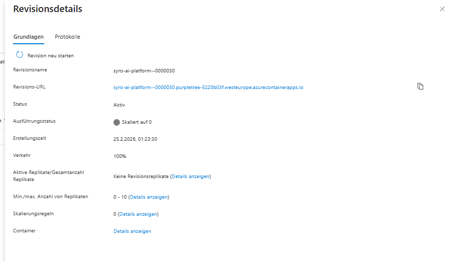

## Azure Container Registry (Image Tags)

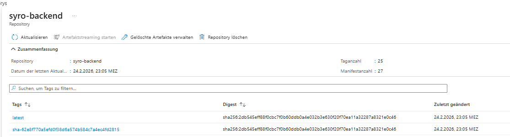

---

# Monitoring & Observability

## Application Insights

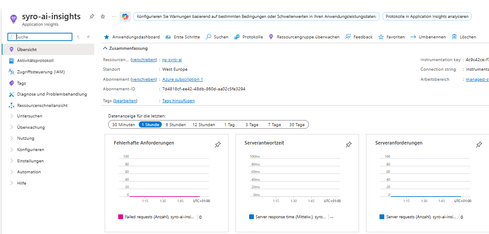

## Azure Warnungsregeln

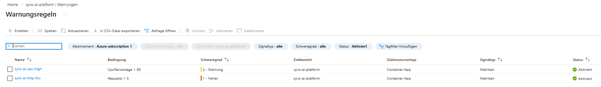

---

# CI/CD Pipeline

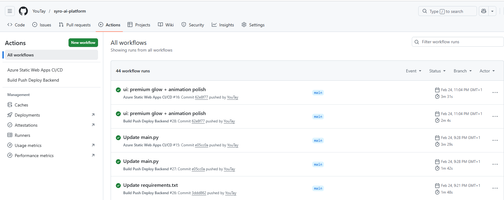

---

# Authentifizierung & Security

## Login

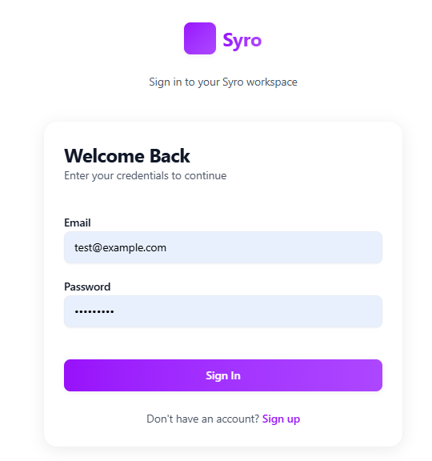

## Registrierung

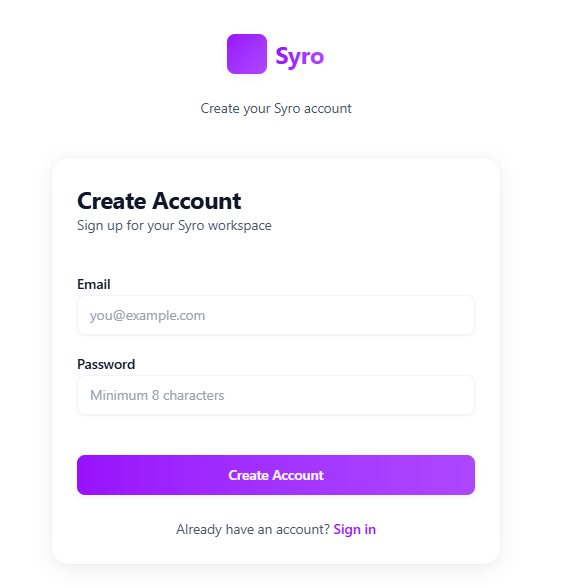

---

# Tech Stack

## Backend
- Python
- FastAPI
- SQLAlchemy
- Pydantic
- python-jose (JWT)
- bcrypt
- Azure Data Tables
- OpenAI API

## Frontend
- Next.js
- TypeScript
- TailwindCSS

## Cloud
- Azure Container Apps
- Azure Container Registry
- Azure Static Web Apps
- Azure Monitor
- Azure Log Analytics
- Application Insights

## DevOps
- Docker
- GitHub Actions
- CI/CD Pipelines

---

# Demonstrierte Kompetenzen

- End-to-End SaaS Entwicklung  
- Multi-User Architektur  
- AI-Integration in produktiver Umgebung  
- Cloud-native Design  
- Container-Orchestrierung  
- Observability & Monitoring  
- Security Best Practices  
- CI/CD Automatisierung  

---

# Relevanz für Unternehmen

Dieses Projekt zeigt:

- AI kann sicher intern betrieben werden  
- Spezialisierte AI Agents steigern Produktivität  
- Microsoft Azure wird professionell eingesetzt  
- Das System ist skalierbar und produktionsbereit  

---

## Kontakt

Offen für Positionen im Bereich  
**AI Engineering · Cloud Engineering · Azure Architecture**
